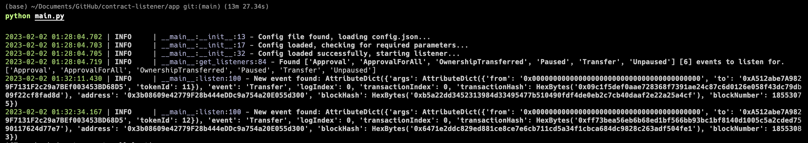

<div align="center">
    <h1>Smart Contract Listener</h1>
    <h3>🎧 Simple, customizable, and continuous EVM based Smart Contract(s) listener.</h3>
</div>

<br>

<div align="center">
	|
    <a href="https://vusal.substack.com">blog</a> |
    <a href="https://gist.github.com/woosal1337">gist</a> |
    <a href="https://github.com/woosal1337/dotfiles">dotfiles</a> |
    <a href="https://www.reddit.com/user/woosal1337">reddit</a> |
    <a href="https://keybase.io/woosal">keybase</a> |
    <a href="https://t.me/woosal1337">telegram</a> |
    <a href="https://twitter.com/woosal1337">twitter</a> |
    <a href="https://www.instagram.com/woosal1337/">instagram</a> |
    <a href="https://open.spotify.com/user/3pd70lv4jpyjbjxjfgysx3pzl">spotify</a> |
    <a href="https://discordapp.com/users/901937888688758785">discord</a> |
    <a href="mailto:woosal@pm.me">mail</a> |
</div>

# Contents
- [1. Introduction](#introduction)
- [2. Features](#features)
- [3. Setup](#setup)
- [4. Usage](#usage)
- [5. License](#license)

# Introduction
Smart Contract Listener is a simple, customizable, and continuous EVM based Smart
Contract(s) listener. It is written in Python and uses `web3.py`. It is designed
to be used as a CLI tool.

Project Structure:
```zsh
├── LICENSE
├── README.md
├── app
│   ├── __init__.py
│   ├── config.json
│   └── main.py
├── docs
│   └── __init__.py
├── requirements.txt
├── src
└── tests
    └── __init__.py
```

# Features
- [x] Simple to use with already set `config.json` file.
- [x] Custom RPC URL support.
- [x] Custom EVM based chains smart contract listening support.
- [x] Simultaneous multiple smart contract listening support.

# Setup
1. Clone the repository and create the environment:
```zsh
$ git clone https://github.com/woosal1337/contract-listener.git
$ $ python3 -m venv venv
$ source venv/bin/activate
$ pip install -r requirements.txt
$ pre-commit install
```

2. Create `config.json` file in `app` directory if does not exist already.
3. By either initializing and running the code for the first time, whereas, a CLI
   will welcome you to enter the required information, or by manually entering them
   all to the `config.json` file before getting started.
4. Before running the code, just edit the launch script, where you would like to run
   your custom listener functions. By default, it is set to `app/main.py`,
   `Transfer` listener.

# Usage


1. Run the code:
```zsh
$ cd app/
$ pwd

> */contract-listener/app

$ python app/main.py
```

# License
- [MIT](LICENSE)
